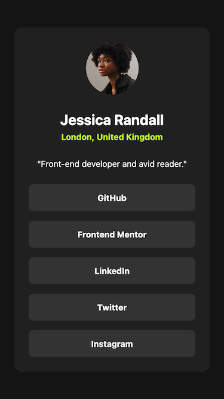
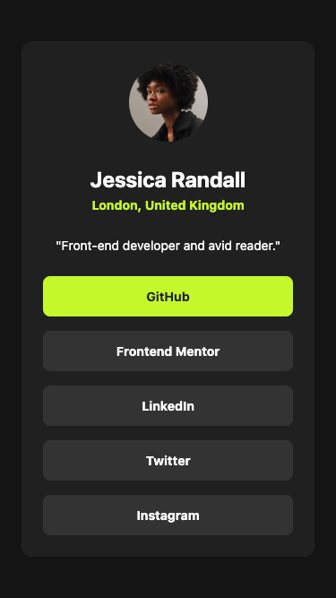
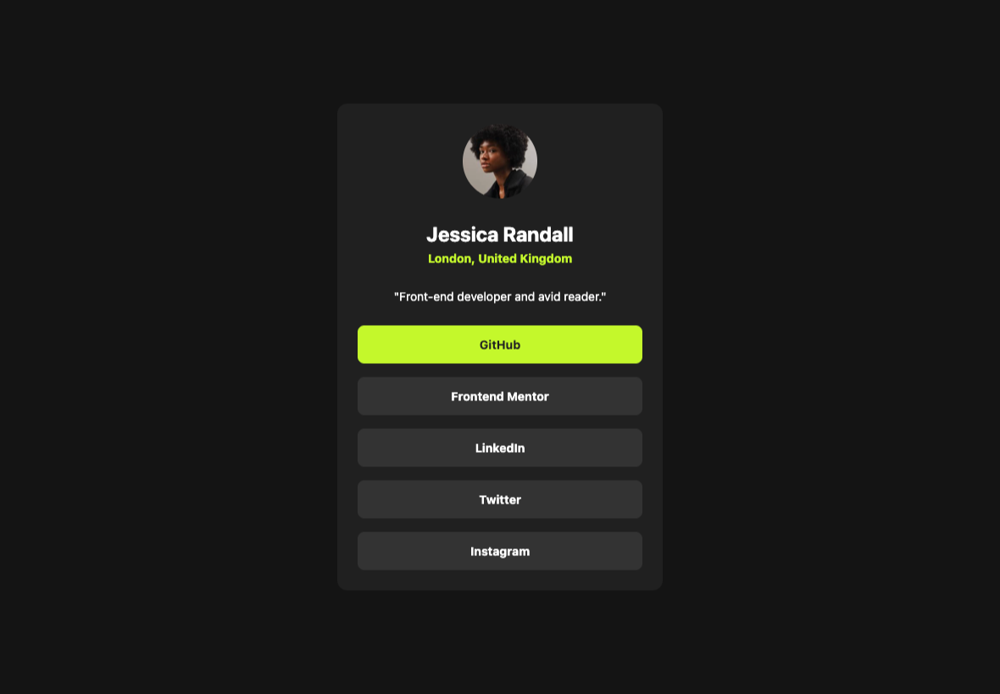

# Frontend Mentor - Social links profile solution

This is a solution to the [Social links profile challenge on Frontend Mentor](https://www.frontendmentor.io/challenges/social-links-profile-UG32l9m6dQ).

## Table of contents

- [Frontend Mentor - Social links profile solution](#frontend-mentor---social-links-profile-solution)
  - [Table of contents](#table-of-contents)
  - [Overview](#overview)
    - [The challenge](#the-challenge)
    - [Screenshot](#screenshot)
      - [Normal states](#normal-states)
      - [Active states](#active-states)
    - [Links](#links)
  - [My process](#my-process)
    - [Built with](#built-with)
  - [Author](#author)

## Overview

### The challenge

Users should be able to:

- See hover and focus states for all interactive elements on the page

### Screenshot

#### Normal states

#### Active states

### Links

- Solution URL: [https://github.com/chiaminchen/social-links-profile](https://github.com/chiaminchen/social-links-profile)
- Live Site URL: [https://chiaminchen.github.io/social-links-profile/](https://chiaminchen.github.io/social-links-profile/)

## My process

### Built with

- Semantic HTML5 markup
- CSS custom properties
- Flexbox

## Author

- Website - [https://github.com/chiaminchen](https://github.com/chiaminchen)
- Frontend Mentor - [@chiaminchen](https://www.frontendmentor.io/profile/chiaminchen)
